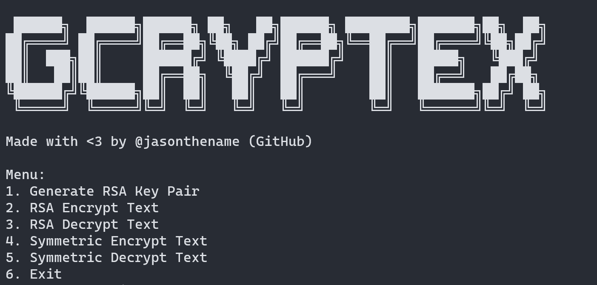

## Usage Instructions:

1.  `python gcryptex.py`
2.  Follow the menu options to perform the desired actions.
3.  For symmetric encryption/decryption with OpenSSL, set the `SYMMETRIC_KEY` environment variable before running the script.

#### Setting the `SYMMETRIC_KEY` Environment Variable:

1.  **Using Command Prompt:**
    
    -   Open Command Prompt.
    -   To set the environment variable for the current session, type:
        `set SYMMETRIC_KEY=your_secret_key` 
    -   To set it permanently (system-wide), you need to open Command Prompt as an administrator and type:
        `setx SYMMETRIC_KEY "your_secret_key" /M` 
        
2.  **Using PowerShell:**
    
    -   Open PowerShell.
    -   For the current session, type:
        `$env:SYMMETRIC_KEY="your_secret_key"` 
        
    -   To set it permanently, use:
        `[System.Environment]::SetEnvironmentVariable('SYMMETRIC_KEY', 'your_secret_key', [System.EnvironmentVariableTarget]::Machine)` 
        

#### Removing the `SYMMETRIC_KEY` Environment Variable:

1.  **Using Command Prompt:**
    
    -   For the current session:
        `set SYMMETRIC_KEY=` 
        
    -   Permanently:
        `setx SYMMETRIC_KEY "" /M` 
        
2.  **Using PowerShell:**
    
    -   For the current session:
        `Remove-Item Env:SYMMETRIC_KEY` 
        
    -   Permanently:
        `[System.Environment]::SetEnvironmentVariable('SYMMETRIC_KEY', $null, [System.EnvironmentVariableTarget]::Machine)` 
        

### For macOS and Linux:

#### Setting the `SYMMETRIC_KEY` Environment Variable:

1.  **Using Terminal:**
    -   Open a terminal window.
    -   To set the environment variable for the current session, type:
        `export SYMMETRIC_KEY=your_secret_key` 
        
    -   To set it permanently, you need to add the above line to your shell profile file (like `.bashrc`, `.bash_profile`, or `.zshrc`), depending on the shell you are using.

#### Removing the `SYMMETRIC_KEY` Environment Variable:

1.  **Using Terminal:**
    -   For the current session:
        `unset SYMMETRIC_KEY` 
        
    -   Permanently:
        -   Open the profile file (`.bashrc`, `.bash_profile`, or `.zshrc`) in a text editor.
        -   Find the line that sets `SYMMETRIC_KEY` and delete or comment it out.
        -   Save the file and restart your terminal or source the profile file.

## Requirements

- Python 3  
-   OpenSSL

## Checking for OpenSSL

Before installation, you should check if OpenSSL is already installed on your system. Open a terminal and run the following commands:

`openssl version`

### Installing OpenSSL

1.  **Debian/Ubuntu-based systems:**
    `sudo apt-get update
    sudo apt-get install openssl` 
    
2.  **Red Hat/Fedora-based systems:**
    `sudo yum update
    sudo yum install openssl` 
    
3.  **Arch Linux:**
    `sudo pacman -Sy openssl`
